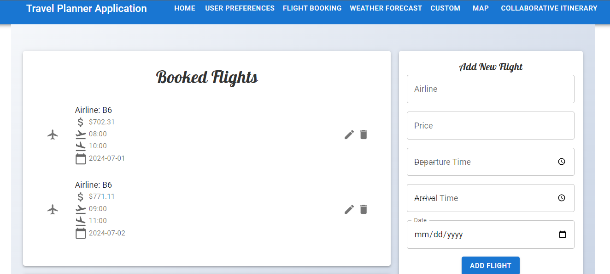
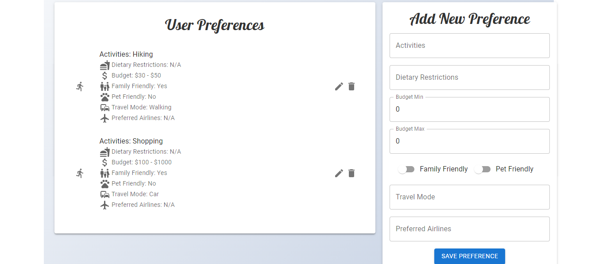
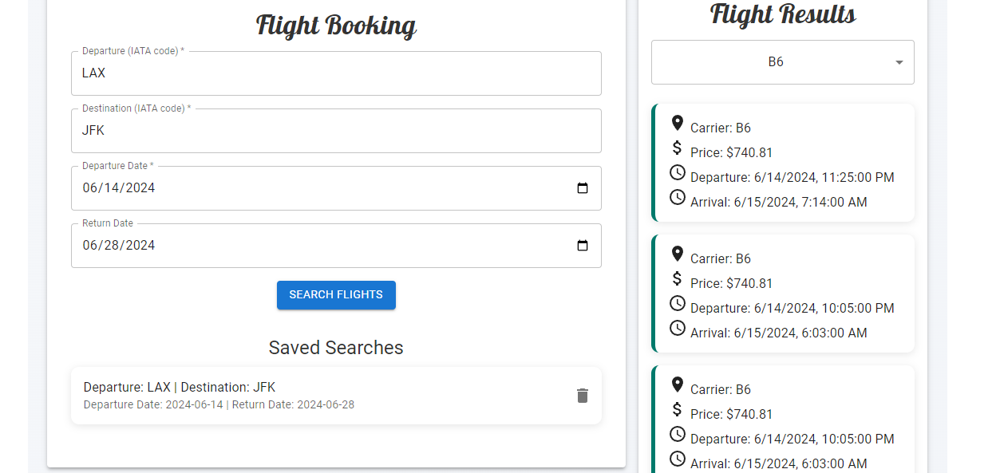
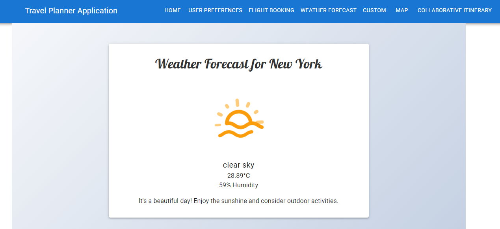
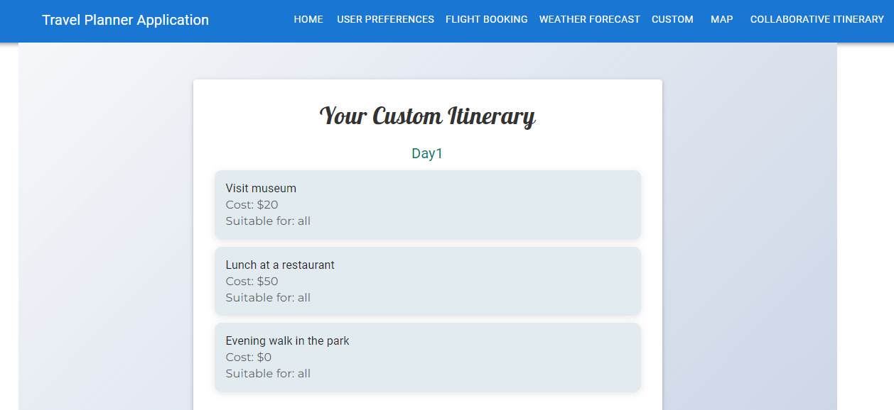
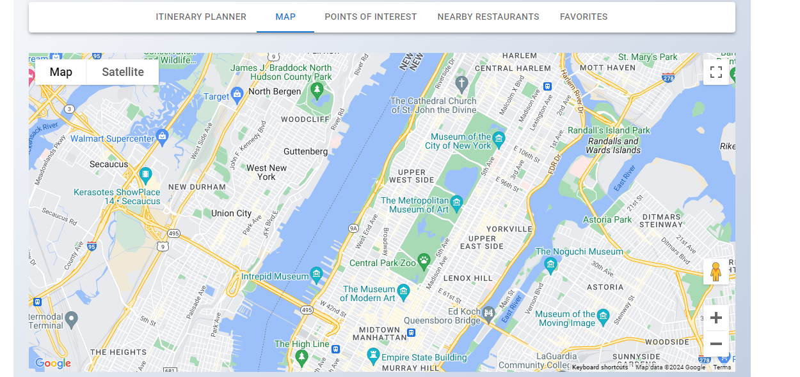
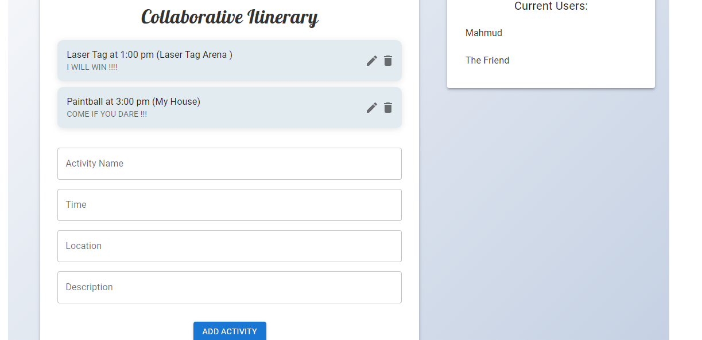

# Travel Planner Application

## Table of Contents
- [Project Overview](#project-overview)
- [Motivation](#motivation)
- [Features](#features)
- [API Integration](#api-integration)
- [Data Flow](#data-flow)
- [User Preferences and Itinerary Customization](#user-preferences-and-itinerary-customization)
- [Collaborative Planning](#collaborative-planning)
- [Mobile Responsiveness](#mobile-responsiveness)
- [Images](#images)
- [Project Prioritization](#project-prioritization)
- [Skills and Methodologies](#skills-and-methodologies)
- [Notable Features](#notable-features)
- [Lessons Learned](#lessons-learned)
- [Challenges and Solutions](#challenges-and-solutions)
- [License](#license)

## Project Overview
The Travel Planner Application is a comprehensive and interactive platform designed to assist users in creating, customizing, and managing their travel itineraries. The application leverages real-time data from various APIs to provide users with up-to-date information about their travel plans, including flights, accommodations, weather forecasts, and more.

## Motivation
The motivation behind this project is to simplify the travel planning process by integrating multiple services into a single platform. This allows users to create a seamless and personalized travel experience by taking into account their preferences and providing them with relevant suggestions and real-time information. The project aims to reduce the complexity of travel planning and make it more enjoyable and efficient.

Additionally, this project was inspired by my personal experience as I am going on a trip for the first time in my life. I wanted to create a tool that I could use to plan my own trip effectively. This application has helped me organize my itinerary, find the best flight options, check the weather, and choose accommodations that suit my preferences and budget.

## Features
- **Booked Flights Management**: Manage and view details of booked flights, with reminders.
- **User Preferences**: Set and save travel preferences, including budget, activities, dietary restrictions, and more.
- **Flight Booking**: Search and book flights based on user input.
- **Weather Forecast**: Get weather updates for the selected destination.
- **Custom Itineraries**: Generate and view custom itineraries based on user preferences.
- **Real-time Data Integration**: Integration with Google Maps, flight booking, weather forecast, and accommodation APIs.
- **Collaborative Planning**: Multiple users can collaboratively plan an itinerary in real-time.
- **Mobile Responsiveness**: Fully responsive design to enhance the user experience on different devices.

## API Integration
### Google Maps API
- **Purpose**: To display maps, routes, and nearby attractions.
- **Usage**: The Google Maps API is used to dynamically display maps based on user input destinations. It provides route planning and nearby attractions to enhance the travel experience.

### OpenWeatherMap API
- **Purpose**: To provide real-time weather forecasts for destinations.
- **Usage**: This API offers current weather data, forecasts, and weather conditions for any location. It helps users plan their activities according to expected weather conditions.

### Amadeus API
- **Purpose**: For searching and booking flights.
- **Usage**: The Amadeus API allows users to search for and book flights. It integrates multiple airline and booking services to find the best options for the user.

### CORS (Cross-Origin Resource Sharing)
- **Purpose**: To enable the frontend application to make requests to the backend server and third-party APIs securely.
-**Usage**: CORS is configured in the backend to allow requests from the frontend domain, ensuring secure and efficient data exchange. This involves setting appropriate headers to control access and permissions for cross-origin requests.

## Data Flow
### User Inputs
- **Step 1**: Users input their travel details, including destination, travel dates, and interests.
- **Step 2**: These inputs are sent to the backend server for processing.

### API Calls
- **Step 3**: The backend makes API calls to fetch real-time data from Google Maps, OpenWeatherMap, and Amadeus APIs.
- **Step 4**: The responses from these APIs are processed to extract relevant information.

### Data Processing
- **Step 5**: The backend interacts with the SQLite database to store and retrieve user preferences and itineraries.
- **Step 6**: The customized itinerary is generated, including suggestions for places to visit, activities, and dining options.
- **Step 7**: Socket.IO handles real-time communication between multiple users for collaborative itinerary planning.

### Display Results
- **Step 8**: The frontend receives the processed data and displays the customized itinerary, maps, weather forecasts, and booking options to the user.

## User Preferences and Itinerary Customization
The backend processes user preferences to tailor itinerary suggestions. Preferences and itineraries are stored in an SQLite database for personalized recommendations. This includes:
- **Activity Preferences**: Types of activities the user enjoys.
- **Dietary Restrictions**: Information to ensure dining options meet user dietary needs.
- **Budget Constraints**: Ensures the itinerary fits within the user’s budget.
- **Family and Pet-Friendly Options**: Customizes the itinerary based on family and pet-friendly activities and accommodations.

## Collaborative Planning
The application allows users to share their itineraries with friends and family, enabling collaborative trip planning in real-time.

## Mobile Responsiveness
The application is fully responsive, ensuring a seamless user experience across different devices, including smartphones and tablets. This is achieved using Material-UI’s responsive design components and CSS media queries.

## Images

## Project Prioritization
### Prioritized Features:
1. **Prioritized Features**: Flight booking, weather updates, user preferences, and custom itineraries were prioritized to ensure the core functionalities were robust.
2. **Collaborative Planning**: Implemented using Socket.IO to allow real-time updates but kept it basic initially to focus on core features.
3. **Scoped Out Features**: Advanced collaborative features like chat and detailed user roles were not included to keep the project manageable.

### Deferred Features:
1. **Advanced Collaborative Features**: Basic collaboration implemented; advanced features deferred due to time constraints.
2. **Detailed Budget Tracking**: Simple budget tracking included; more detailed features planned for future releases.

## Skills and Methodologies
### Skills:
- **Frontend Development**: React, Material-UI, Axios, Lottie for animations
- **Backend Development**: Flask, Flask-SQLAlchemy, Flask-SocketIO, Flask-CORS
- **Database**: SQLite
- **API Integration**: Working with Google Maps, OpenWeatherMap, and Amadeus APIs
- **Real-time Features**: Socket.IO for collaborative planning
- **Version Control**: Git for source code management

### Methodologies:
- **Agile Development**: Iterative approach with regular updates and feedback.
- **Test-Driven Development (TDD)**: Writing tests to ensure functionality and reliability.
- **Code Reviews**: Regular reviews to maintain code quality and consistency.

## Notable Features
- **Real-time Collaborative Planning**: Multiple users can edit the same itinerary simultaneously, with real-time updates visible to all participants.
- **Custom Itinerary Generation**: Automatically generate a detailed itinerary based on user preferences, including activities, dining options, and points of interest.
- **Flight and Weather Integration**: Seamlessly integrate flight booking and weather forecasting into the travel planning process.

## Lessons Learned
- **Improved Programming Skills**: Enhanced my skills in React, API integration, Python (Flask), CSS (Material-UI, CSS, Lottie), and Socket Programming (Axios).
- **Socket Programming**: Gained experience with real-time communication using Socket.IO, enhancing collaborative features.
- **Client-Server Architecture**: Developed a deeper understanding of client-server interactions, especially with a real-time component.
- **API Integration**: Successfully integrated multiple APIs (Amadeus for flights, OpenWeather for weather, Google Maps for location data) into a cohesive application.
- **State Management**: Managed complex state changes and data flow in a React application, particularly with asynchronous data fetching and real-time updates.

## Challenges and Solutions
### Challenge 1: Real-time Collaborative Planning
- **Problem**: Ensuring that multiple users can simultaneously update and view the same itinerary in real-time without conflicts.
- **Solution**: Implemented Socket.IO for real-time communication. This allowed the application to send and receive updates instantly across all connected clients. To handle conflicts, we set up a system where changes are broadcasted to all users, and the latest update is always displayed.

### Challenge 2: Seamless Integration of Multiple Features
- **Problem**: Integrating various functionalities such as flight booking, weather forecasting, and itinerary planning into a single cohesive application.
- **Solution**: Used a modular approach to design the application, breaking down features into individual components. Leveraged React for component-based architecture and maintained a consistent state management approach using React's useState and useEffect hooks.

### Challenge 3: Ensuring Data Security and Privacy
- **Problem**: Handling sensitive user data such as preferences and travel plans securely.
- **Solution**: Applied best practices for data security, including using HTTPS for secure communication, validating and sanitizing all user inputs, and securely managing API keys and tokens. Implemented CORS policies to restrict unauthorized access.

## License
This project is licensed under the MIT License. See the [LICENSE](LICENSE) file for more details.
